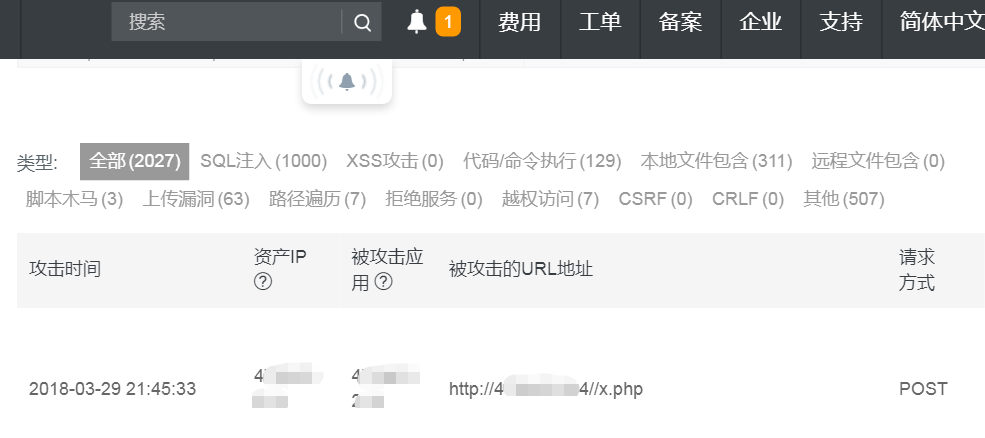

## 简介

```html
        #######################################################################
        ################                           		###############
        ################   项目方向：博客园/平台   		###############
        ################   项目名称：斑马缘        		 ###############
        ################   官网：http://miniblog.top 	      ##################
        ################                          		###############
        #######################################################################
        
	MiniBlog是一个迷你博客园(平台)，由项目负责人兼小组长“油果”，以及他的团队们“zebra”（斑马）开发小组
共同完成以及维护的实例项目。
	我们的服务宗旨是：提供免费的入驻博客园服务，享受免费的博文发布以及博文管理服务！MiniBlog欢迎您的入驻！
```
演示：[斑马缘](http://miniblog.top)


## install
```php
# 历史源码：直接从 GitHub 上克隆即可获得；

# SVN install
svn export svn://不愿暴露IP/ --username 不愿暴露用户名 --password 不愿暴露密码 --no-auth-cache  --force
# 最新版本：开源时间：2018-04-12 之后可以发 email 获取完整的svn的指令！

# MySQL 
导入根目录下“zebra.sql”文件，记得删除SQL文件！

# TP3 MySQL配置
\Application\Common\Conf\config.php

return array(
	//'配置项'=>'配置值'
	// 模板布局
	'LAYOUT_ON'=>true,
	'LAYOUT_NAME'=>'layout',
	//数据库配置信息
	'DB_TYPE'   => 'mysql', // 数据库类型
	'DB_HOST'   => 'localhost', // 服务器地址
	'DB_NAME'   => 'zebra', // 数据库名
	'DB_USER'   => 'root', // 用户名
	'DB_PWD'    => 'root', // 密码
	'DB_PORT'   => 3306, // 端口
	'DB_PREFIX' => 'zebra_', // 数据库表前缀 
	'DB_CHARSET'=> 'utf8', // 字符集
);

# 有疑问请来信：当前页面的底部有联系方式。
```


## 开发环境参考

`预定开发环境选择(LNMP)：Linux/CentOS6.8.32+Nginx/Stableversion1.12.2 +MySQL+PHP/5.6.34`


## 矛与盾的关系

> * 没有密不透风的墙，只有知道如何进攻的，才能更好的防御！
>
> * 自从在（[虎绿林](https://hu60.net)）PHP论坛公布域名以来，这是持续了8天的恶意请求记录，服务器还好好的，可能是真正的高手不屑出手吧！昨天禁用了好几个PHP函数，还改了ssh端口。
>
>   


## 第二阶段的开发日志

> * “无期限”任务，所有团队成员参与迭代开发，项目维护。
>
>   1. 警告：只能擅自编辑自己开发的功能模块，其他成员开发的模块你只能私下沟通协商提意见，尽量杜绝“擅自改动别人开发的模块”。
>
>   2. 宏观分工(考虑到大家工作都挺忙的，后续开发大家看心情参与)：
>
>      * @油果，
>
>        a. 负责运维工作（服务器和域名）；
>
>        b. 处理反馈邮件；
>
>        c. 维护自己开发的功能模块；
>
>      * ​@...........


## 第一阶段的开发日志

> * 详细的开发日志（预算一个月，争取3月底上线测试）：
>
>   1. （任何新增板块都要通过团队审核）
>
>      博文管理模块：NULL ||模块负责人自己准备一份日志  ||后期考虑合并
>
>      权限管理模块：NULL ||模块负责人自己准备一份日志  ||后期考虑合并
>
>      注册登陆模块：NULL ||模块负责人自己准备一份日志  ||后期考虑合并
>
>      .............NULL	............ ||模块负责人自己准备一份日志  ||后期考虑合并
>
>      Ps:提倡程序猿们发散思维，只要有创意，基本上都会同意新增板块！团队成员务必养成写开发日志的习惯。
>
> * 部署开发环境(2018-03-01)：
>
>   1. 团队成员必须了解 SVN 的搭建以及使用;
>   2. 部署线下本地开发环境；
>   3. @油果，负责部署线上开发环境；
>
> * 邀请网友/好友入伙（预定人数5），商讨项目相关事宜（预算2天2018.2.26/2.27）：
>
>   1. 项目类型、项目名称、开发团队名称、项目LOGO；
>
>   2. 是否上线运维；
>
>   3. 域名以及服务器的选择；
>
>   4. 项目初始资金 114 RMB；
>
>   5. 确定成员名单：
>
>      + 项目负责人@油果，email:Admin#tlip.cn
>
>      + 程序媛@柯小花，
>
>      + 程序猿@王小贱，
>
>      + 程序猿@冰镇可乐，
>
>      + 程序猿@油条and豆浆；
>
>        ​

## 联系我们

Email: Admin#tlip.cn